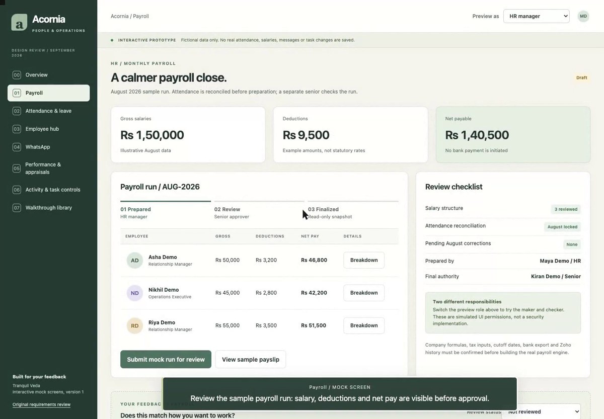
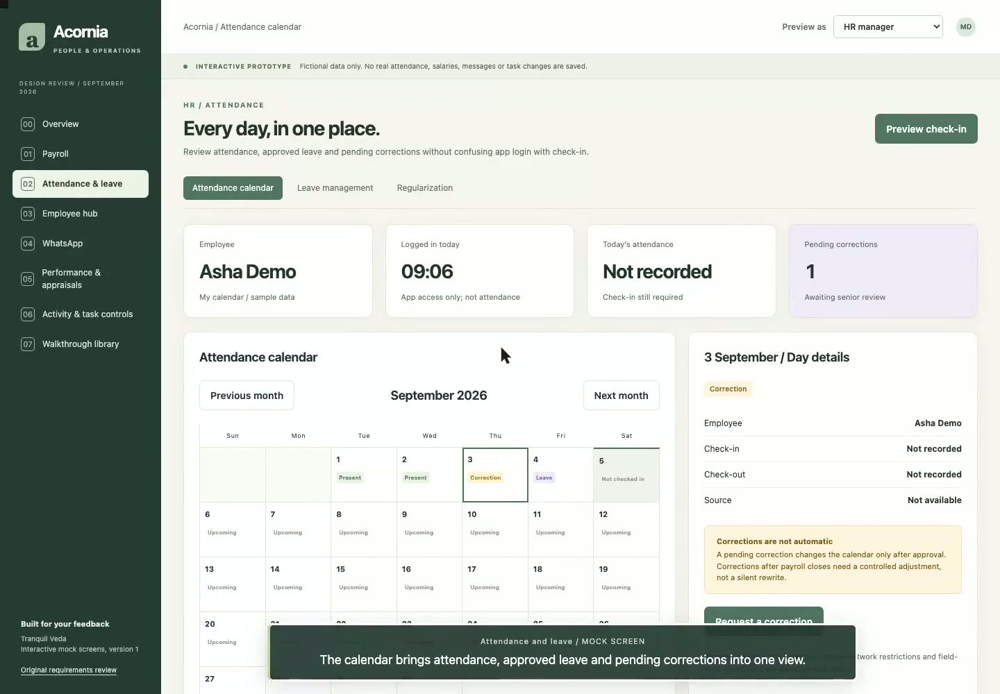
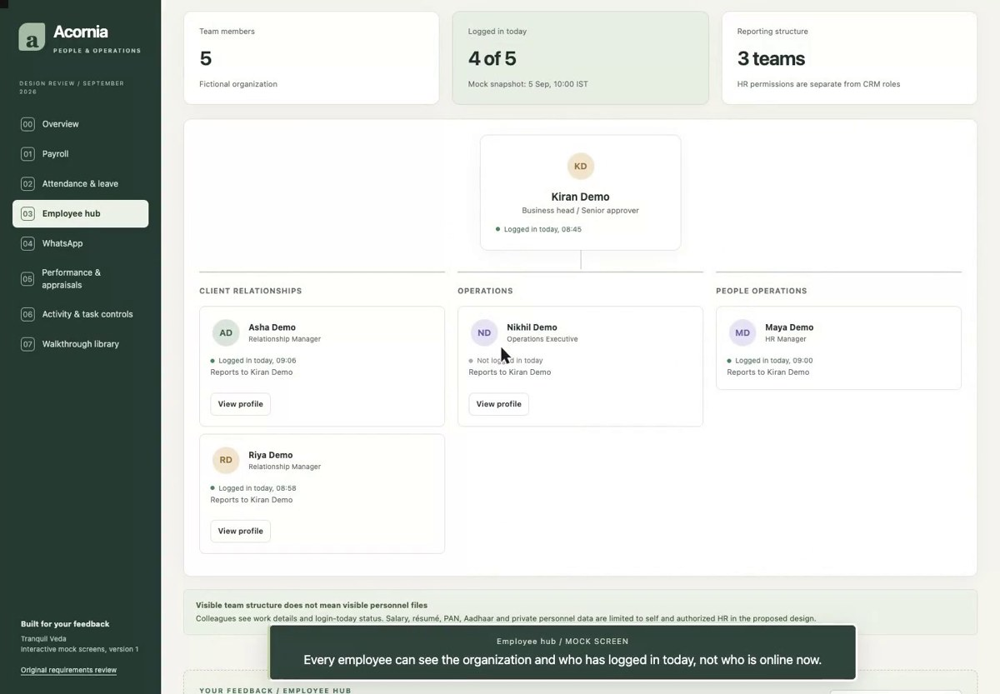
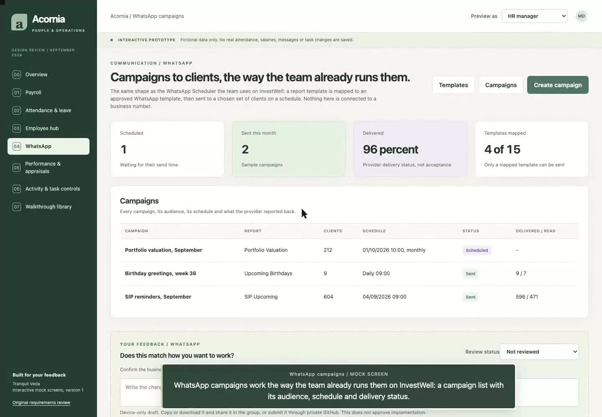
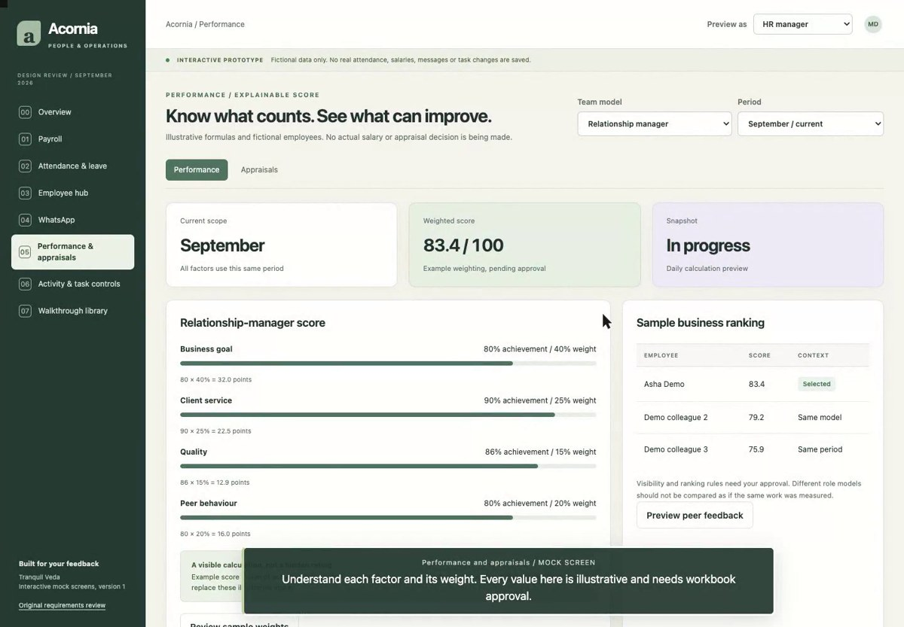
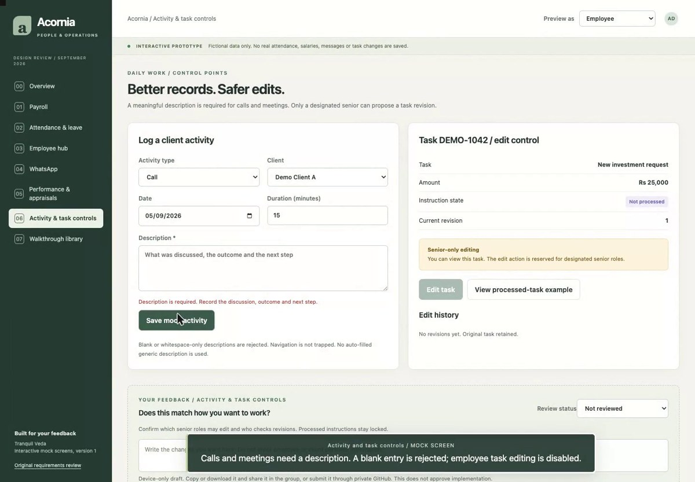

# Acornia people and operations: review guide

These are six interactive mock modules, not production changes. Every person, amount, document and message is fictional. Videos are intentionally silent with on-screen captions.

[Open the mock collection](./) · [Watch all six walkthroughs](./#videos)

Use the **Preview as** selector to try HR manager, Employee and Senior approver. Switching roles demonstrates the proposed experience, not real authentication. Reloading resets simulated transactions. Feedback drafts stay only on your device until you explicitly share them.

## 1. Payroll

[Screens](./#payroll) · [Video](videos/01-payroll.mp4)

Review the sample salary components. As HR manager, submit the draft; as Senior approver, inspect and finalize it. Switch to Employee to see one employee's sample payslip. Confirm the approval chain, payroll calendar, deductions and payslip fields. No payment or statutory calculation is performed.

## 2. Attendance, leave and regularization

[Screens](./#attendance) · [Video](videos/02-attendance-leave.mp4)

Compare app login with attendance. Approve the pending time correction, try converting an eligible absence to leave, and submit a new leave request. Review the resulting calendar. Preview the check-in: it starts with the employee ID, typed or scanned, then a face-ID match, and only then is attendance recorded with time and source. Confirm leave entitlements, half-day rules, holidays, correction deadlines and the check-in devices. No camera is accessed in this mock.

## 3. Employee hub

[Screens](./#people) · [Video](videos/03-employee-hub.mp4)

Explore the organization, login-today indicators and profiles. Compare a self profile with a colleague's restricted document view; then switch to HR. Review resume, PAN, Aadhaar and photo placeholders, and browse policies by year. Confirm the reporting structure, permitted document access, retention and policy acknowledgement process. Do not upload real identity documents to this public mock.

## 4. WhatsApp

[Screens](./#whatsapp) · [Video](videos/04-whatsapp.mp4)

Built on the shape of the WhatsApp Scheduler the team already uses on InvestWell. Create a campaign: name it, choose the clients (family heads only, exclusions, search by name, relationship manager, PAN or mobile), choose a mapped report template, schedule it once or monthly, and watch it join the campaign list. Open Templates to map a report to its approved WhatsApp template by API campaign name, with category, format and sample values. Confirm the business number, which report templates to map first, the sending hours and who may create campaigns. Nothing here sends a real message.

## 5. Performance and appraisals

[Screens](./#performance) · [Video](videos/05-performance-appraisals.mp4)

Compare relationship-manager and operations scores, daily/monthly periods, and the locked-month example. Try the salary what-if and peer-feedback form. Submit a self-review as Employee, then finalize a manager review as Senior approver. Confirm score weights against the approved workbook, reviewer eligibility, peer-feedback privacy and the review cycle. All formulas are illustrative; no real compensation decision is implied.

## 6. Activity and task controls

[Screens](./#controls) · [Video](videos/06-activity-task-controls.mp4)

Try saving an activity without a description, then with a useful description. Employee task edits are disabled. As Senior approver, propose a sample amount change with a reason and inspect the separate checker step and history. Try the processed-task lock. Confirm which roles count as seniors, eligible fields, checker independence and exceptions.

## Share your feedback

Each module has a review-status selector and a comment box. Choose a status, describe requested changes, then copy or download the feedback and share it in Jarvis Daily Group. The private GitHub submission is another explicit sharing route and requires access. A local draft is not a submitted review.

Please comment on the experience, rules and missing cases, without entering employee or client personal information. Mock-screen feedback does not authorize implementation. Approved requirements will be consolidated separately before any production work.
